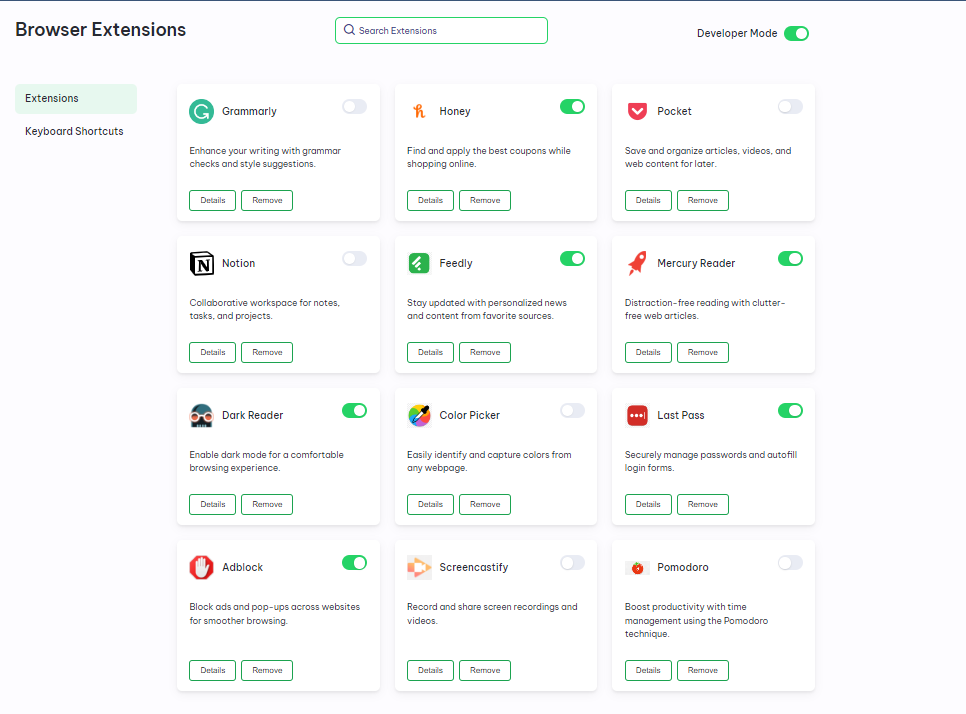
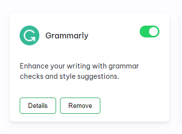

# Enhancing User Experience: Browser Extension Manager

### Subtitle: A Deep Dive into Design, Functionality, and User-Centric Features

In the realm of web browsing, Browser extensions have become indispensable tools, augmenting functionality and personalization. Inspired by the seamless user experience of Chrome Extension Manager, a web platform is developed, whose design intricacies and problem-solving aspects have been included below.

### Efficient Design Approach

The platform's design philosophy is centered on mirroring the streamlined interface of the Chrome Extension Manager. The homepage features a sleek search bar, swiftly connecting users to their desired extensions. Extensions are presented in card format, mimicking the visual cues of the Chrome Extension Manager. This choice promotes familiarity, making user engagement and navigation seamless and intuitive.

### Innovative User Interaction Solutions

The platform aimed to go beyond replication, focusing on enhancing user experience. The focus is to make extension management intuitive. On how to provide details and removal options without clutter to which is the solution emerged as an elegant card design, displaying extension info and a 'Remove' button for easy control.

The toggle button is a simple addition that allows instant enabling or disabling of extensions, showcasing problem-solving prowess. User interaction is the key, and the toggle button streamlined a potentially complex action, making it effortless and smooth.

### The User-Centric Side Panel

Inspired by the Chrome Extension Manager's 'Keyboard Shortcuts,' this left-side panel enhances user experience. Users can effortlessly search for extension-related keyboard shortcuts, highlighting the dedication to address user needs through innovative problem-solving.

### Comprehensive Extension Cards

Central to the platform's functionality, each extension card is a powerhouse of information. A concise one-liner introduces the extension's purpose, making it easy for users to grasp its functionality at a glance. The extension's logo and name adorn the card, enhancing recognition and accessibility.

Positioned at the top right corner, the toggle button is a focal point. This button provides a seamless way to enable or disable the extension's functionality, empowering users with effortless control over their browsing experience.

Clicking the detail button unfolds a wealth of information. The card elegantly expands to unveil comprehensive details about the extension, including its features, permissions, and any pertinent notes. This intuitive design ensures that users can make informed decisions about each extension's relevance.

Lastly, the remove button, strategically placed, empowers users to declutter their extension collection with ease. By removing unwanted extensions directly from the extension manager, users can tailor their browsing experience to their preferences.

These thoughtfully integrated elements in the extension cards signify a harmonious blend of user-centric design and pragmatic functionality, elevating the overall experience of managing extensions.
